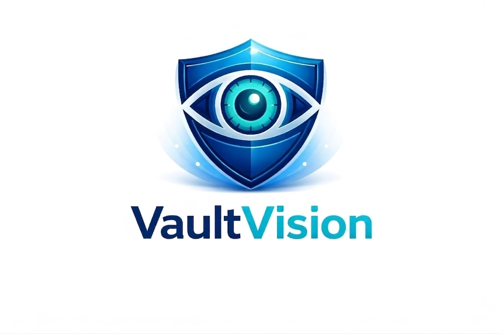
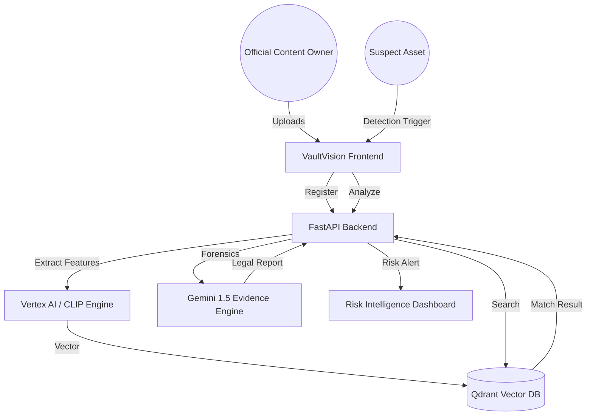

# VaultVision: AI-Powered Digital Asset Protection  🛡️

**VaultVision** represents our mission to protect valuable digital sports media using AI. “Vault” signifies strong security for digital assets, while “Vision” reflects our use of intelligent computer vision to detect and prevent unauthorized usage.

---

## 🎯 UN Sustainable Development Goal Alignment
VaultVision directly contributes to **SDG 9: Industry, Innovation, and Infrastructure**.
- **Target 9.5**: Enhancing scientific research and upgrading technological capabilities.
- **Impact**: By protecting the intellectual property of creators and organizations, VaultVision fosters a sustainable digital economy and encourages continued innovation in the media and sports industries.

---

## 🚀 The Challenge: The Billion-Dollar Piracy Leak
Sports organizations lose over **$28.3 Billion** annually to illegal streams and unauthorized media usage (Source: *Synamedia & Ampere Analysis*). 
- **Legacy Failure**: Current tools rely on pixel-matching or watermarking, which are easily bypassed by flipping an image, adding a filter, or changing playback speed.
- **Manual Burden**: Verifying infringements and generating DMCA reports is a slow, manual process that can't keep up with the speed of social media.

## 🛡️ Our Solution: VaultVision
VaultVision introduces a **"Semantic First"** approach to content protection.

### 1. Hybrid AI Detection (Vertex AI + CLIP)
Unlike legacy systems, VaultVision uses **Semantic Embeddings**. It understands the *content* of the image. Even if a pirate crops 50% of the screen or applies a "night vision" filter, the AI recognizes the core signature of the official broadcast.

### 2. Evidence Engine (Powered by Gemini 1.5)
The "killer feature" of VaultVision. Once a match is detected, **Gemini 1.5 Flash** acts as an AI Forensic Analyst. It analyzes the differences between the original and the suspect asset, determines the risk level, and generates a professional legal report instantly.

### 3. Risk Intelligence Dashboard
A high-performance command center for security teams, featuring:
- **60FPS Real-time Monitoring** (Framer Motion).
- **3D Visualization of Vector Space** (Three.js).
- **Automated Risk Scoring** (High/Medium/Low).

---

## 🛠️ Technology Stack

| Layer | Technologies |
| :--- | :--- |
| **AI / Machine Learning** | Google Gemini 1.5 Flash, Vertex AI Multimodal Embeddings, CLIP |
| **Frontend** | Next.js 14 (App Router), Tailwind CSS, Framer Motion, Three.js |
| **Backend** | FastAPI (Python), PyTorch, SQLAlchemy |
| **Databases** | **Qdrant** (Vector Database for sub-second search), **PostgreSQL** |
| **Authentication** | Google OAuth 2.0 |
| **Deployment** | Google Cloud Run, Cloud SQL, Google Cloud Storage |

---

## 🏗️ Architecture

---

## 👥 Members Contribution

| Name | Role | Contributions |
| :--- | :--- | :--- |
| **[Gautam Bandil/Lead]** | Lead AI Architect & Backend | Architected the Hybrid AI pipeline, integrated Vertex AI & Gemini 1.5, and developed the FastAPI core. |
| **Supriya** | Frontend Specialist | Developed the premium dashboard using Next.js 14, Framer Motion animations, and 3D visualizations with Three.js. |
| **[Member 3]** | Data Engineer & DevOps | Managed Qdrant vector store optimization, PostgreSQL schema design, and Google Cloud deployment (Cloud Run). |
| **Khushi Singh** | UI/UX & Product | Designed the user journey, handled legal prompt for Gemini |

---

## 🧪 How to Test

### Prerequisites
- Python 3.9+
- Node.js 18+
- Google Cloud API Key (for Gemini & Vertex)

### Backend Setup
1. `cd backend`
2. `pip install -r requirements.txt`
3. Create a `.env` file in the root based on `.env.example` and add your `GOOGLE_API_KEY`.
4. `uvicorn main:app --reload`

### Frontend Setup
1. `cd frontend`
2. `npm install`
3. `npm run dev`

### Demo Walkthrough
1. **Registry**: Upload an official match clip/image to the "AI Vault".
2. **Detector**: Upload a modified version of the same image (cropped/filtered).
3. **Analyze**: Watch as the system detects the match and **Gemini** generates a legal report in seconds.

---

## 📈 Future Roadmap
- [ ] **Live Stream Interception**: Direct CDN integration for sub-second stream blocking.
- [ ] **Blockchain Proof**: Anchoring Gemini-generated evidence on-chain for immutable legal proof.
- [ ] **1-Click Takedown**: API integration with YouTube, Twitch, and X for automated DMCA filing.

---

**VaultVision** - *Securing the Future of Digital Sports.*
Built with ❤️ for the **Google Solution Challenge 2026**.
